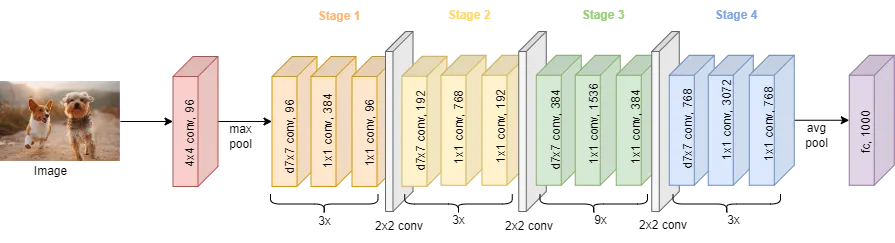
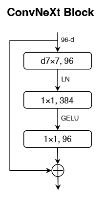
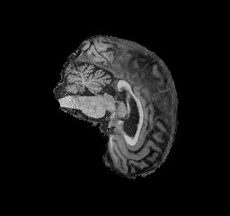
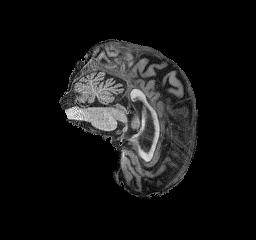
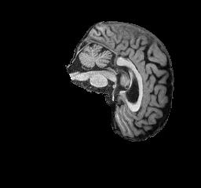
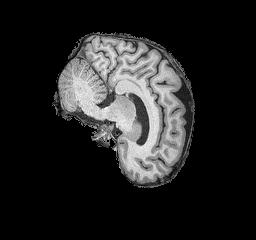
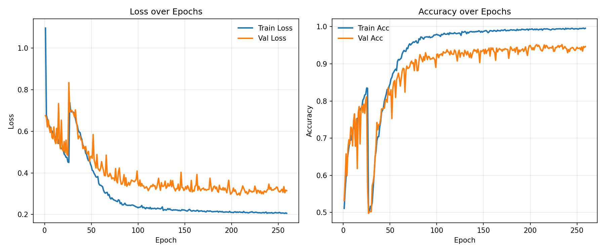
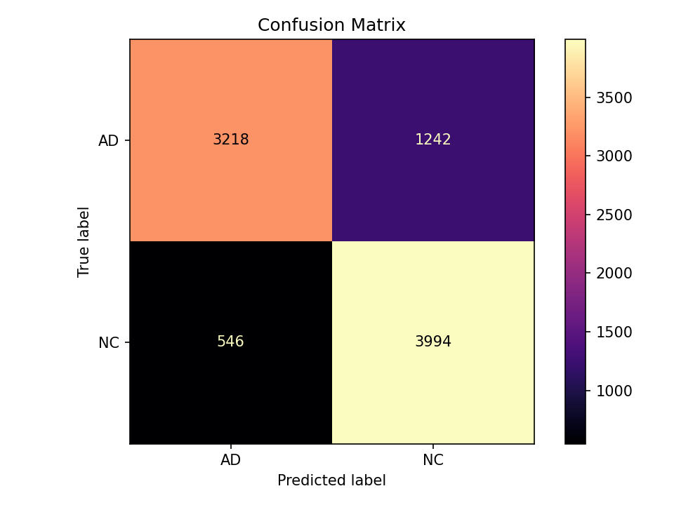
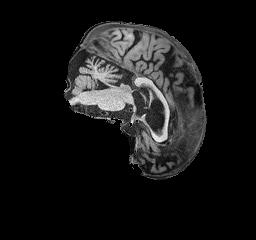
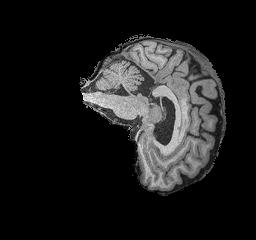

# Alzheimer's Disease Classification using ConvNeXt

# Overview  

Alzheimer’s disease (AD) is a neurodegenerative disease and is one of the most common forms of dementia. As there is currently no cure, research and treatment focus primarily on prevention and early detection, making timely diagnosis critically important [[1]](#ref1). 

In this project, our goal is to reach 80% accuracy on classifying MRI brain images as either Alzheimer’s Disease (AD) or Normal Control (NC) using the ConvNeXt-Tiny architecture.

# Model Architecture

The ConvNeXt architecture is a modern convolutional neural network inspired by the design principles of Vision Transformers. It introduces key improvements such as depthwise convolutions, LayerNorm, GELU activations, residual scaling, and a hierarchical stage structure.  


<p align="center"><em>Figure — ConvNeXt general structure <a href="#ref3">[3]</a></em></p>

The ConvNeXt architecture consists of the following components:

### Patch Partitioning:
A 4×4 convolution with stride 4 divides the input image into non-overlapping patches, converting each patch into an embedded feature token. For a 256×256 image, this results in a 64
×64 grid of patch embeddings with 96 channels.

### Hierarchical Feature Representation:
The network consists of 4 stages, each with multiple ConvNeXt blocks. Channel dimensions increase (96 → 192 → 384 → 768), while spatial dimensions decrease through strided convolutions. This hierarchy enables learning of both low-level texture and high-level structural patterns.

<p align="center">
  
</p>

<p align="center"><em>Figure — ConvNeXt block <a href="#ref2">[2]</a></em></p>


### Global Average Pooling and Linear Head:
After the final stage, global average pooling condenses features, followed by a linear head producing 2-class logits (AD vs NC).

Due to its balance between efficiency and representational power, ConvNeXt-Tiny is highly suitable for medical imaging tasks requiring structural sensitivity and spatial consistency.

# Dataset Description

The dataset used is the Alzheimer’s Disease Neuroimaging Initiative (ADNI) dataset, which contains MRI scans from patients with Alzheimer’s Disease (AD) and normal controls (NC) classification. Each image is grayscale with an original resolution of 256×240 pixels and is padded to 256×256 for input into the model.

| Split |   AD  |   NC  | Total |
|-------|-------|-------|-------|
| Train | 10,400| 10,820| 21,220|
| Val   | 2,160 | 2,140 | 4,300 |
| Test  | 4,460 | 4,540 | 9,000 |

A patient-wise split ensures that all slices from a single patient remain in the same partition, preventing data leakage and ensuring fair evaluation.

### Example MRI Images
**AD Images**  


**NC Images**  


# Training Process
___

The model was trained from scratch using PyTorch with AdamW optimisation, CrossEntropyLoss, and CosineAnnealingLR scheduling. Early stopping was used based on validation loss with a patience of 50 epochs.

### Hyperparameters
- Batch Size: 256  
- Learning Rate: 0.004  
- Weight Decay: 0.01  
- Num Epochs: 500  
- Warmup Epochs: 10  
- Patience: 50  
- Label Smoothing: 0.1  
- Drop Path Rate: 0.2

### Transformations

To improve robustness, the following augmentations were used:

1. Padding (256×240 → 256×256)  
2. Random Affine (±7° rotation, ±4% translation, 0.97–1.03 scaling)  
3. Brightness/Contrast jitter (±15%)  
4. Random Gamma (0.9–1.1)  
5. Gaussian Blur (p=0.2)  
6. Small random noise and erasing (p=0.25)  
7. Normalisation (mean=0.5, std=0.5)

Transformations were kept mild to ensure anatomical integrity of MRI images.

# Results

### Performance Metrics

The training and validation losses and accuracies were recorded across epochs, as shown below.


<p align="center"><em>Figure — Training and validation performance curves</em></p>

- Rapid improvement to ~0.78 val acc by ~20 epochs, then steady to ~0.94–0.95.
- Brief wobble around epochs 27–33 (due to scheduler).
- Small, stable gap (train ≈0.99 vs val ≈0.94).
- Best checkpoint: val loss 0.2928 @ epoch 209; early stop at 259.

### Confusion Matrix

<p align="center"><em>Figure — Confusion matrix on the test set</em></p>

- The confusion matrix visualises the classifier’s performance across both classes.
- Out of 9,000 test images:

- AD (Alzheimer’s Disease): 3,218 correctly predicted, 1,242 misclassified as NC.

- NC (Normal Control): 3,994 correctly predicted, 546 misclassified as AD.

This corresponds to a precision of 0.85 for AD and 0.76 for NC, aligning with the classification report results below.
### Classification Report

Accuracy: 0.8013

| Class | Precision | Recall | F1-Score | Support |
|---|---|---|---|---|
| AD | 0.8549 | 0.7215 | 0.7826 | 4460 |
| NC | 0.7628 | 0.8797 | 0.8171 | 4540 |

### Example Predictions

| MRI Image | Predicted Label | AD Confidence | NC Confidence | Reference Label |
|-----------|-----------------|---------------|---------------|-----------------|
|  | AD | 0.9474 | 0.0526 | AD |
|  | NC | 0.0483 | 0.9517 | NC |

<p align="center"><em>Table — Model predictions on unseen MRI test samples</em></p>


# Usage
To train or evaluate the model, follow these steps.

### 1. Clone the repository

```bash
git clone https://github.com/MinhQuocLe/PatternAnalysis-2025
git checkout topic-recognition
cd ./recognition/s4939494-convNeXt
```

### 2. Install dependencies

```bash
pip install torch torchvision timm scikit-learn matplotlib numpy tqdm
```


### 3. Adjust directory
Assuming the dataset has been downloaded and is in its original format,  adjust the file structure to be as follows:

`/home/groups/comp3710/ADNI/AD_NC` or manually change the Hyperparameters data_root in `train.py` 

The trained model checkpoint (.pth) will be saved automatically in the logs/ directory.

```
/home/groups/comp3710/ADNI/AD_NC/
    train/
        AD/
            ad_001.jpg
            ad_002.jpg
            ...
        NC/
            nc_001.jpg
            nc_002.jpg
            ...
    test/
        AD/
            ad_001.jpg
            ad_002.jpg
            ...
        NC/
            nc_001.jpg
            nc_002.jpg
            ...

s4939494-ConvNeXt/
    dataset.py
    modules.py
    train.py
    predict.py
    utils.py
    logs/
        best_convnext.pth
        confusion_matrix_test.png
        report_test.txt
```

### 4. Train the model

To train the model, run the following command.

```bash
$ python train.py
```

### 5. Evaluations
To evaluate the model, run the following commands with optional arguments:

```bash
$ python predict.py [--eval] [--ckpt <path>] [--image <path>]
```
Options:

    --eval (optional) Evaluate model accuracy on the test dataset.
    (Default behaviour if no arguments are given)

    --ckpt <path> (optional) Path to a custom checkpoint (.pth) file.
    Default: logs/best_convnext.pth

    --image <path> (optional) Run prediction on a single MRI image instead of evaluating the dataset.

# References

<a id="ref1">[1]</a> Todd S, Barr S, Roberts M, Passmore AP (2013). Survival in dementia and predictors of mortality: a review. International Journal of Geriatric Psychiatry, 28(11), 1109–1124. https://doi.org/10.1002/gps.3946

<a id="ref2">[2]</a> Liu Z, Mao H, Wu C-Y, Feichtenhofer C, Darrell T, Xie S (2022). A ConvNet for the 2020s. arXiv:2201.03545. https://arxiv.org/abs/2201.03545

<a id="ref3">[3]</a> Erdoğan, A. (2023). *ConvNeXt: Next Generation of Convolutional Networks.*  
Medium. Available at: [https://medium.com/@atakanerdogan305/convnext-next-generation-of-convolutional-networks-325607a08c46](https://medium.com/@atakanerdogan305/convnext-next-generation-of-convolutional-networks-325607a08c46)
